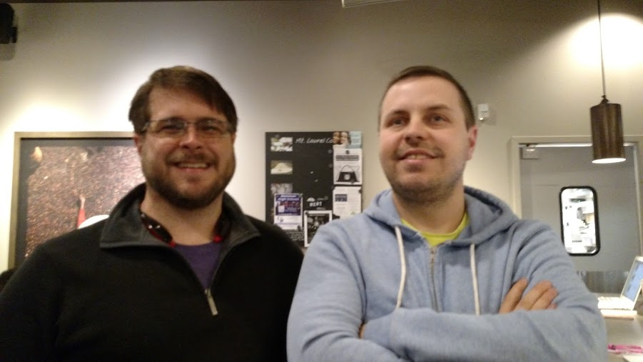

# Asymmetric Rhythm Tool

Created by Brian Sleeper and Jack Amoratis on 5/17/14.
We think this is awesome source code, but in all humility, there's nothing proprietary going on here. An NSTimer, some sounds being played, some decimals being converted into fractions. That pretty much represents the functionality of this asymmetric rhythm tool. All you need to do is wire this code to a UITableView along with some buttons, a slider, and a few labels, and you will have your own working asymetric rhythm app. If you want to make use of this code, then feel free to fork it, or just cut and paste it into your project.
 - Jack Amoratis and Brian Sleeper
 
 
## License
To the extent possible under law, we (Brian Sleeper and Jack Amoratis) have waived all copyright and related or neighboring rights to this source code. This work is published from: United States. No warranty is expressed or implied, nor is any fitness for a particular purpose implied. Use at your own risk.

## How it Came to Be
When Jack mentioned that he was thinking of making a metronome but was wondering how to justify bringing yet another metronome into the world, Brian Sleeper, a friend who was a music teacher, mentioned that some metronomes are variable. There is nothing new about this concept, but not many apps do it so it would be interesting. Brian offered some music theory about metronomes and Jack set about building a variable metronome app. There are already metronomes on the market with this same functionality so Jack looked at their interfaces and translated that into an app paradigm.

## The Future
Version 2.0 is here! This project is complete in terms of being a minimal viable product. No frills, just a working metronome. Enjoy and contribute.
